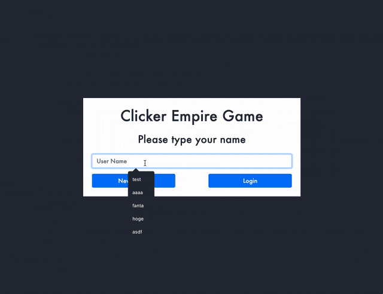

# Clicker Empire Game
ハンバーガーを売ったり、株や不動産に投資して大金持ちを目指すシミュレーションゲームです。<br>
RecursionのProject3の課題です。
# URL
https://fanta335.github.io/Clicker-Empire-Game/
# DEMO

- ユーザー名を入力し、[New Game]ボタンでゲームを始めます。
- ハンバーガーアイコンをクリックすると所持金が増えます。
- アイテムを購入すると、クリックごとの収入が増えたり、時間経過による収入、つまり不労所得が得られます。
- 右下にある :leftwards_arrow_with_hook: は、データリセットボタンです。同じユーザー名で初期状態からリスタートします。
- :floppy_disk: はデータ保存ボタンです。ユーザー名を入力してから[Login]ボタンでゲームを続きからプレイすることができます。
# Installation

```
$ git clone https://github.com/Fanta335/Clicker-Empire-Game.git
$ cd Clicker-Empire-Game
```
